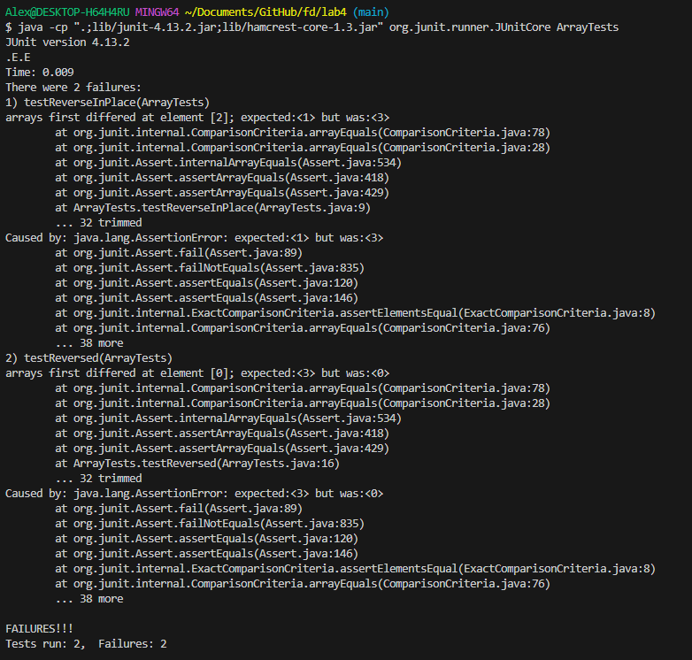

# Lab Report 3 - Alexander Zhen 

## Part 1 - Bugs
> In part 1, I will be using the `ArrayExamples.java` as the chosen bug. 

* A failure-inducing input for the `ArrayExamples.java` program, as a JUnit test and any associated code:

```
import static org.junit.Assert.*;
import org.junit.*;

public class ArrayTests {
  @Test 
  public void testReverseInPlace() {
      int[] input1 = {1,2,3,4,5}; //create an array of numbers
      ArrayExamples.reverseInPlace(input1); //pass input1 through the reverseInPlace().
      assertArrayEquals(new int[]{5,4,3,2,1}, input1); //compares the input1 array that was passed through the ArrayExamples.java program to an array with the expected 
      output. 
}
  @Test
  public void testReversed() {
      int[] input1 = {1,2,3}; //create an array of numbers. 
      assertArrayEquals(new int[]{3,2,1}, ArrayExamples.reversed(input1)); //then, compare the input1 array that was passed through the ArrayExamples.java to an 
      array with the expected output. 
}  
}

```
> In the original tests for `testReverseInPlace()` and `testReversed()`, it would pass because in the original test for `testReverseInPlace`, it only had one element in the array (which was just the value of 3) and when passed through the `reverseInPlace()` method, it would still give us the array of 3, giving us a pass. The original test for `testReversed()`, it only compared two empty arrays, also giving us a pass. Therefore, in order to create a test that shows that there are bugs in the `ArrayExamples.java`, we would have to "spoon-feed" it, by giving it a sizeable array, show that correct order of the array in respect to the test and then compare the two arrays in order to properly test.
---
 
* An input that *doesn't* induce a failure, as a JUnit test and any associated code:
```
import static org.junit.Assert.*;
import org.junit.*;

public class ArrayTests {
  @Test 
  public void testReverseInPlace() {
     int[] input1 = {3}; //using a single element array
     ArrayExamples.reverseInPlace(input1); //pass input1 through the reverseInPlace().
     assertArrayEquals(new int[]{3}, input1); //compares the input1 array that was passed through the ArrayExamples.java program to an array with the expected 
     output. 
}

  @Test
  public void testReversed() {
     int[] input1 = {}; //using an empty array
     assertArrayEquals(new int[]{}, ArrayExamples.reversed(input1)); //then, compare the input1 array that was passed through the ArrayExamples.java to an array with the expected output. 
}
  @Test 
  public void testAverageWithoutLowest(){
     double[] input1 = {90.0, 80.0, 70.0, 60.0, 50.0}; //create an array of numbers
     assertEquals(75.0, ArrayExamples.averageWithoutLowest(input1), 0.0); //since the average of the array without 50.0 is 75.0, compare it to the input1 array 
     that was passed through the averageWithoutLowest method as well as the delta value.
}
}
```
>  As mentioned in the previous point, the original tests provided does not induce a failure, using a single element array and an empty array for the `reverseInPlace()` and `reversed()` methods. Now included is the test for the `averageWithoutLowest()` method, where you give it an array of elements greater than 2, then calculate the average without the lowest number (in this case, 50.0), which would come out to be 75.0. Then compare the expected average to the `input1` value when passed through the `averageWithoutLowest` method.
---

* The symptom, as the output of running the tests (provide it as a screen shot of running JUnit with at least the two inputs above):

> When I ran the tests using the inputs from first *failure-inducing* inputs, it gave me two failures for `testReverseInPlace` and `testReversed`. In `testReversedInPlace`, this test was to see if the elements in the array would be reversed in place. In the failure message, it states that in `testReverseInPlace`, the 2nd element in the array was 
* The bug, as the before-and-after code change required to fix it (as two code blocks in Markdown):


## Part 2 - Researching Commands

