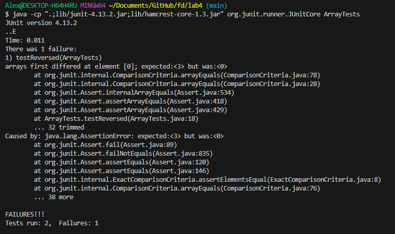

# Lab Report 3 - Alexander Zhen 

## Part 1 - Bugs
> In part 1, I will be using the `ArrayExamples.java` as the chosen bug. 

* A failure-inducing input for the `ArrayExamples.java` program, as a JUnit test and any associated code:

> Within the `ArrayExamples.java` program, I tested the `reversed() method` using `ArrayTests.java`.
```
  @Test
  public void testReversed() {
    int[] input1 = {1,2,3}; //create an array of numbers. 
    int [] reversedInput1 = {3,2,1}; //create a new array with the expected reversed order of the first array.
    int [] testArray = ArrayExamples.reversed(input1); //create another array that takes the reversed array from the ArrayExamples.java. 
    assertArrayEquals(reversedInput1, testArray); //then we would compare the two arrays if they are similar. 
  }
```
> In the original test for `testReversed()`, it contained an empty array, which is passed through the `reversed() method`
 
* An input that *doesn't* induce a failure, as a JUnit test and any associated code:
* The symptom, as the output of running the tests (provide it as a screen shot of running JUnit with at least the two inputs above):
* The bug, as the before-and-after code change required to fix it (as two code blocks in Markdown):


## Part 2 - Researching Commands

