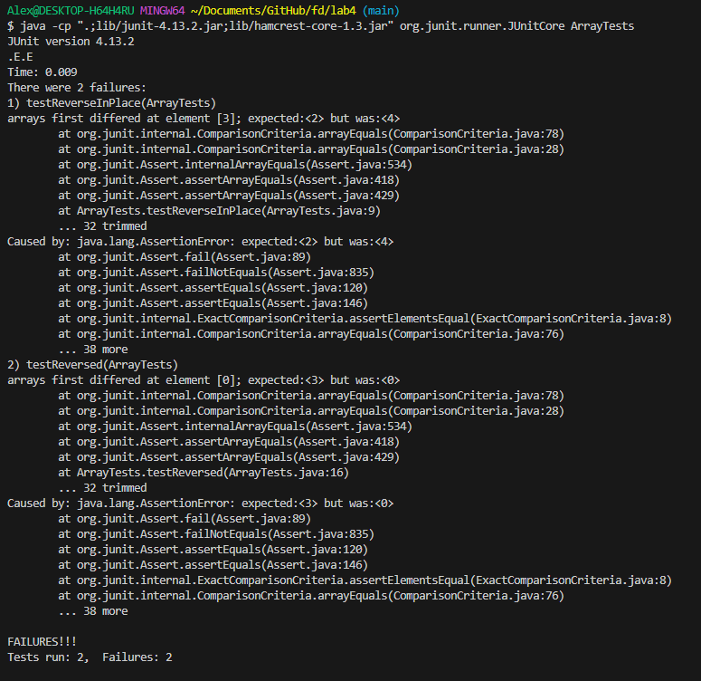

# CSE 15L - Lab Report 3 - Alexander Zhen 

## Part 1 - Bugs
> In part 1, I will be using the `ArrayExamples.java` as the chosen bug. 

* A failure-inducing input for the `ArrayExamples.java` program, as a JUnit test and any associated code:

```
import static org.junit.Assert.*;
import org.junit.*;

public class ArrayTests {
  @Test 
  public void testReverseInPlace() {
      int[] input1 = {1,2,3,4,5}; //create an array of numbers
      ArrayExamples.reverseInPlace(input1); //pass input1 through the reverseInPlace().
      assertArrayEquals(new int[]{5,4,3,2,1}, input1); //compares the input1 array that was passed through the ArrayExamples.java program to an array with the expected 
      output. 
}
  @Test
  public void testReversed() {
      int[] input1 = {1,2,3}; //create an array of numbers. 
      assertArrayEquals(new int[]{3,2,1}, ArrayExamples.reversed(input1)); //then, compare the input1 array that was passed through the ArrayExamples.java to an 
      array with the expected output. 
}  
}

```
> In the original tests for `testReverseInPlace()` and `testReversed()`, it would pass because in the original test for `testReverseInPlace`, it only had one element in the array (which was just the value of 3) and when passed through the `reverseInPlace()` method, it would still give us the array of 3, giving us a pass. The original test for `testReversed()`, it only compared two empty arrays, also giving us a pass. Therefore, in order to create a test that shows that there are bugs in the `ArrayExamples.java`, we would have to "spoon-feed" it, by giving it a sizeable array, show that correct order of the array in respect to the test and then compare the two arrays in order to properly test.


---
 
* An input that *doesn't* induce a failure, as a JUnit test and any associated code:
```
import static org.junit.Assert.*;
import org.junit.*;

public class ArrayTests {
  @Test 
  public void testReverseInPlace() {
     int[] input1 = {3}; //using a single element array
     ArrayExamples.reverseInPlace(input1); //pass input1 through the reverseInPlace().
     assertArrayEquals(new int[]{3}, input1); //compares the input1 array that was passed through the ArrayExamples.java program to an array with the expected 
     output. 
}

  @Test
  public void testReversed() {
     int[] input1 = {}; //using an empty array
     assertArrayEquals(new int[]{}, ArrayExamples.reversed(input1)); //then, compare the input1 array that was passed through the ArrayExamples.java to an array with the expected output. 
}
  @Test 
  public void testAverageWithoutLowest(){
     double[] input1 = {90.0, 80.0, 70.0, 60.0, 50.0}; //create an array of numbers
     assertEquals(75.0, ArrayExamples.averageWithoutLowest(input1), 0.0); //since the average of the array without 50.0 is 75.0, compare it to the input1 array 
     that was passed through the averageWithoutLowest method as well as the delta value.
}
}
```
>  As mentioned in the previous point, the original tests provided does not induce a failure, using a single element array and an empty array for the `reverseInPlace()` and `reversed()` methods. Now included is the test for the `averageWithoutLowest()` method, where you give it an array of elements greater than 2, then calculate the average without the lowest number (in this case, 50.0), which would come out to be 75.0. Then compare the expected average to the `input1` value when passed through the `averageWithoutLowest` method.
---

* The symptom, as the output of running the tests (provide it as a screen shot of running JUnit with at least the two inputs above):
  

> * When I ran the tests using the inputs from first *failure-inducing* inputs, it gave me two failures for `testReverseInPlace` and `testReversed`.
> * In the failure message, it states that in `testReverseInPlace`, the 3rd element in the array was 4, when the expected should be 2. This tells us that the `reverseInPlace()` method took the array given ([1,2,3,4,5]), passed through the `reverseInPlace()` method and overwritten the 3rd element in the array with 2, because when i = 3 for arr[3] = arr[5 - 3 - 1], it assigned arr[3] with arr[2]. Giving us [5,2,3,2,5] at i = 3. Coinciding with i = 4, where arr[4] = arr[0], giving us [1,2,3,2,5]. 
> * In the failure message for `testReversed`, it states that the expected value in 1st element was 3, but it was 0. This is caused by the bug in the `reversed()` method, where a new array called `newArray` was created with the same length as the array that's being tested. This meant that the new array, `newArray` only consists of values of 0 for a particular array length. Therefore, `arr[i] = newArray[arr.length - i - 1]` basically rewrote all of the values in our test array ([1,2,3]) and set them all to 0. An example would be when i = 0, arr[0] = 1, but we set it equal to newArray[3 - 0 - 1], which is newArray[2] = 0. So, arr[0] = 0. Leaving us with [0,2,3] and would continue on with the other elements until it is [0,0,0]. 
---
* The bug, as the before-and-after code change required to fix it (as two code blocks in Markdown):
> Before code change:
```
public class ArrayExamples {

  // Changes the input array to be in reversed order
  static void reverseInPlace(int[] arr) {
    for(int i = 0; i < arr.length; i += 1) {
      arr[i] = arr[arr.length - i - 1];
    }
  }

  // Returns a *new* array with all the elements of the input array in reversed
  // order
  static int[] reversed(int[] arr) {
    int[] newArray = new int[arr.length];
    for(int i = 0; i < arr.length; i += 1) {
      arr[i] = newArray[arr.length - i - 1];
    }
    return arr;
  }
```
> After code change:
```
public class ArrayExamples {

  // Changes the input array to be in reversed order
  static void reverseInPlace(int[] arr) {
    int left = 0; //this would be the first element of the array. 
    int right = arr.length - 1; // this would be the last element of an array.
    while (left < right){ 
      int start = arr[left]; //this would be the start of the array, which would be some value in arr[0], in our case, 1. 
      arr[left] = arr[right]; //right would be the end of the array, now it basically switches arr[0] and arr[arr.length - 1]
      arr[right] = start; //now the right side of the array is now the beginning of the array. 

      left++; //moves onto the next element of the array, which is arr[1] = 2.
      right--; //moves down the element of the array, which is arr[3] = 4, continuing to switch until it meets in the middle.
    }
  }

  // Returns a *new* array with all the elements of the input array in reversed
  // order
  static int[] reversed(int[] arr) {
    int[] newArray = new int[arr.length];
    for(int i = 0; i < arr.length; i += 1) {
      newArray[i] = arr[arr.length - i - 1]; //instead of setting arr[i] = newArray, where it only receives values of 0, set newArray[i] = the original array.
    }
    return newArray; //instead of returning the arr, return the newArray with the reversed array. 
  }

```
---
## Part 2 - Researching Commands

> In part 2, I will be looking at the command `grep`, which helps us search for specific texts or patterns within a text file.

1. Using the `grep -n` command
> The `grep -n` command is structured as follows: `grep -n "some word you would like to search" [filename]`. In this `grep` command, it helps us search for a particular word in a text. It goes through every line in the txt file, searching for the specific word and noting which line has that specific word.

Example of using the `grep -n` command:
```
$ grep -n "alcohol" Session2-PDF.txt
9:Many patients in the emergency department (ED) have alcohol
13:further examine and refine alcohol-screening questionnaires in the
23:illness, and from problematic consumption to alcohol use disorder.
27:screening for several alcohol endpoints. Acute intoxication is of
29:certainly be considered an "alcohol problem." The blood or breath
30:alcohol concentration (BAC), coupled with our clinical
31:observations, may help us identify intoxication. Most alcohol
32:screening tests identify patients with alcohol use disorders or
33:problematic consumption of alcohol. The American Psychiatric
36:(ICD-9, -10) have rigorously defined alcohol abuse and alcohol
40:cases of alcohol abuse meet the ICD-10 definition. In general, an
...
```
> When I ran the `grep -n` command, using the file `Session2-PDF.txt` from `technical/government/Alcohol_Problems` to search for the word "alcohol", it displayed each line that contained the word "alcohol" and noted which line it occurred as well. Knowing which line that contains a specific text or pattern is pretty useful in allowing us to quickly access that exact location and I believe it is also useful for documenting. 
> 
Another example of using `grep -n` command:
```
$ grep -n "Fiscal" ~/docsearch/technical/government/Gen_Account_Office/d01591sp.txt
112:Q4.1. How Has Federal Fiscal Policy Affected U.S. National
124:Q4.5. What are the Implications of Current Fiscal Policy
260:Alternative Fiscal Policy Simulations (2000-2075) 86
265:Figure 4.4:GDP Per Capita Under Alternative Fiscal Policy
2331:America Save for its Old Age? Fiscal Policy, Population Aging, and
2849:Q4.1. How Has Federal Fiscal Policy
2931:"Federal Budget Estimates, Fiscal Year 2001," Survey of Current
2933:pp. 16-25; or Budget of the U.S. Government: Fiscal Year 2001,
3080:see N. Gregory Mankiw, "The Saver-Spender Theory of Fiscal Policy,"
3200:Long-Term Fiscal Outlook (GAO/AIMD/OCE-98-19, October 22, 1997),
3201:Budget Issues: Long-Term Fiscal Outlook (GAO/T-AIMD/OCE-98-83,
3205:Balancing Fiscal Risk (GAO-01-385T, February 6, 2001).
...
```
> In this example, I used the `grep -n` command to search for the word "Fiscal", using a relative path to a specific text file. Again, it displays each line that the word "Fiscal" occurs in and denotes which line it occurs on.
---

2. Using the `grep -A` command
> The `grep -A` command is pretty interesting, it searches for a specific text and then you include n-number of lines you would want to print after it finds that specific word. The `grep -A` command is structured as follows: `grep -A (# of lines) "text" [Filename]`.

Example of using the `grep -A (#number of lines) command`:
```
$ grep -A 3 identify Session2-PDF.txt
to identify these patients has been conducted, but several areas of
interest should be addressed by further research. We need to
further examine and refine alcohol-screening questionnaires in the
ED. We need to determine the sequence and combination of questions
--
study barriers to screening, identify factors that promote
screening implementation, and demonstrate the impact of a screening
program in the ED. The final aim of screening must be improved
outcomes through referral and counseling. Identification is only
--
observations, may help us identify intoxication. Most alcohol
screening tests identify patients with alcohol use disorders or
problematic consumption of alcohol. The American Psychiatric
Association in DSM III-R, IV2 and the World Health Organization
(WHO) in the 9th and 10th International Classification of Diseases
--
...
```
> In this example of using the `grep -A` command, I used it to search for the word "identify" in the `Session2PDF.txt` and I wanted it to print out 3 lines after it finds the word "identify. When we look at the example, the first line contains the word "identify" and then it follows up with the next 3 lines of text. It continues to do so until the end of the text file. This would be useful when you are looking up a specific text or pattern and you want some sort of context of why it's there.

Another example of using the `grep -A` command:
```
$ grep -A 2 "cells" ~/docsearch/technical/biomed/1471-213X-3-2.txt
        class that transforms C57mg mouse mammary epithelial cells
        and also promotes duplication of the dorso-ventral axis
        when over-expressed in Xenopus embryos. Wnts in this
--
        of Wnts does not transform C57mg cells nor promote axis
        duplication. Instead, when over-expressed in frog or fish
        embryos, these Wnts perturb the movements of gastrulation.
--
        endogenous expression of Wnt-5a maintains C57mg cells in a
        normal growth state since anti-sense Wnt-5a mimics Wnt-1
        transformation of C57mg cells [ 12 ] . This data suggests
        that Wnt-1 and Wnt-5a work in an opposing manner in some
        cellular contexts. This potential role of Wnt-5a as a tumor
--
        ectopic Wnt-5a in human uroepithelial cells prevents
        tumorigenesis when injected into athymic nude mice [ 13 ]
        .
--
...
```
> This is another example of using the `grep -A` command, using it look for the word "cells" using a relative path to file I wanted to look into. It looks for the word "cells" and prints out the next 2 lines as well. In this example, in the 3rd search, it contains two occurences of "cells", one of them is included in the 2 lines that is being printed and then it prints out 2 more lines afterwards. 
---
3. Using the `grep -R` command
> The `grep -R` command helps us search for a pattern or specific text within a directory. This means that if you gave `grep -R` a specific word and a directory, it will look through all the files in that directory and print out the location of the file that contains the word, as well as the text in that file. The command is structured as follows: `grep -R "some word" /path`.

Example of using the `grep -R` command:
```
$ grep -R "Economic" ~/docsearch/technical/government/
/c/Users/Alex/docsearch/technical/government/About_LSC/ONTARIO_LEGAL_AID_SERIES.txt:initiated by the federal government's Office of Economic
/c/Users/Alex/docsearch/technical/government/Env_Prot_Agen/jeffordslieberm.txt:Economic Analysis of a Multi-Emissions Strategy
/c/Users/Alex/docsearch/technical/government/Env_Prot_Agen/jeffordslieberm.txt:Table 3. Summary of Economic Impacts by Scenario - 2010
/c/Users/Alex/docsearch/technical/government/Env_Prot_Agen/jeffordslieberm.txt:Protocol: An Economic Analysis to Reduce Carbon Pollution, Tellus
/c/Users/Alex/docsearch/technical/government/Env_Prot_Agen/jeffordslieberm.txt:DeCanio, Stephen J., 1997. "Economic Modeling and the False 
/c/Users/Alex/docsearch/technical/government/Env_Prot_Agen/jeffordslieberm.txt:Tradeoff Between Environmental Protection and Economic Growth,"
/c/Users/Alex/docsearch/technical/government/Env_Prot_Agen/jeffordslieberm.txt:Contemporary Economic Policy, Vol. 15 (October): 10-27, 1997.
/c/Users/Alex/docsearch/technical/government/Env_Prot_Agen/jeffordslieberm.txt:Protocol on U.S. Energy Markets and Economic Activity,      
/c/Users/Alex/docsearch/technical/government/Env_Prot_Agen/jeffordslieberm.txt:Hanson, Donald A, 1999. A Framework for Economic Impact Analysis
/c/Users/Alex/docsearch/technical/government/Env_Prot_Agen/jeffordslieberm.txt:Climate Change Economics and Policy: An RFF Anthology, edited by MA
/c/Users/Alex/docsearch/technical/government/Env_Prot_Agen/jeffordslieberm.txt:Preparing Economic Analysis, EPA-240-R-00-003, Office of the/c/Users/Alex/docsearch/technical/government/Env_Prot_Agen/jeffordslieberm.txt:Bureau of Economic Analysis (BEA) interindustry data, which 
a
...
```
> In this example, I used `grep -R` to search for a term "Economic" in the `/government` directory. This gave me the absolute paths of the text files that contain the search term of "Economic", as well as a line from the text file containing it. The `grep -R` would really be useful for saving time on trying to find which file contains a certain search term/pattern, as it will point to the path of that specific file and display the line of text it is in. I believe it would be useful when working in larger codebases, when you're trying to find a specific string from all the files, it would save quite a bit of time.

Another example of using the `grep -R` command:
```
$ grep -R "organisms" ~/docsearch/technical/plos
/c/Users/Alex/docsearch/technical/plos/journal.pbio.0020012.txt:        family of proteins with members in higher organisms, including SIR-2.1, an enzyme that
/c/Users/Alex/docsearch/technical/plos/journal.pbio.0020012.txt:        enzymes in lower organisms. Unlike SIRT-1, these related enzymes are known to increase
/c/Users/Alex/docsearch/technical/plos/journal.pbio.0020012.txt:        research, notably by replicating the yeast work in higher organisms. “We have very
/c/Users/Alex/docsearch/technical/plos/journal.pbio.0020012.txt:        he says. “If that's true—and it really seems to be true for a lot of organisms—if it's true
/c/Users/Alex/docsearch/technical/plos/journal.pbio.0020012.txt:        ageing in worms, but the mutations inhibit its action and enable the organisms to live
/c/Users/Alex/docsearch/technical/plos/journal.pbio.0020035.txt:        For half a century, natural products from microorganisms have been the main source of
/c/Users/Alex/docsearch/technical/plos/journal.pbio.0020035.txt:        Streptomyces is the best-known genus. These organisms make an
/c/Users/Alex/docsearch/technical/plos/journal.pbio.0020035.txt:        studies were on organisms making antibiotics of the ‘aromatic’ family, which includes
/c/Users/Alex/docsearch/technical/plos/journal.pbio.0020042.txt:        the fundamental workings of biological organisms, I propose a small science, relatively
/c/Users/Alex/docsearch/technical/plos/journal.pbio.0020043.txt:        degree of cooperation between two organisms (or tissues) must depend upon their degree of
/c/Users/Alex/docsearch/technical/plos/journal.pbio.0020043.txt:        classical cytogenetics in favor of the molecular biology of model organisms, and these
/c/Users/Alex/docsearch/technical/plos/journal.pbio.0020043.txt:        organisms, chimeras are temporary and unstable. How have scale insects suppressed the
/c/Users/Alex/docsearch/technical/plos/journal.pbio.0020053.txt:        years, tiny organisms have engaged in an arms race, hurling toxic molecules at each other
...
```
> This is another example of using the `grep -R` command, I used the search term of "organisms" and wanted to look for which files in the `plos` directory had this specific term. Similar to the last example, it gave me the absolute path of the txt files and the line of text that contains the search term.
---
4. Using the `grep -v` command:
> The `grep -v` command inverts the search, basically the opposite of the last 3 examples of grep, it will only display the lines that does not include the text or pattern that is specified. The `grep -v` command is structured as follows: `grep -v "text or pattern" [Filename]`.

Example of using the `grep -v` command:
```
$ grep -v "Barnes" Barnes_pro_bono.txt
Duane D. Stanford
Wednesday, December 18, 2002
Steven Gottlieb thought it was a joke when he checked his
work for the Atlanta Legal Aid Society.
Gottlieb, who was vacationing in New Zealand, asked his
secretary to check it out. She confirmed the unbelievable --- it
"I've never heard of a former governor going to work for a legal
aid program," said Gottlieb. "I take that as an incredible
compliment."
will go to work for the nonprofit group for six months, donating
speaking at a press conference attended by Gottlieb, said his first
priority has always been to look out for Georgians' interests.
"Holding elective office is not the only way to help others,"
in Marietta before winning the governor's race in 1998.
that dogged him during his re-election campaign and contributed to
his surprise loss to Sonny Perdue on Nov. 5. Asked about his legacy
up to others to determine."
...
```
> Using the `grep -v` command, I wanted to omit the search term of "Barnes" from the `Barnes_pro_bono.txt` text file. When doing so, every line that contained the search term of "Barnes" was not included in the output. I believe this would be useful in filtering out lines that you don't want to see or like specific keywords, allowing you focus on something more relevant to the issue at hand.

Another example of using the `grep -v` command:

```
$ grep -v "molecules" ~/docsearch/technical/plos/journal.pbio.0020012.txt
        The pathologist makes do with red wine until an effective drug is available, the
        biochemist discards the bread from her sandwiches, and the mathematician indulges in
        designer chocolate with a clear conscience. The demographer sticks to vitamin supplements,
        and while the evolutionary biologist calculates the compensations of celibacy, the
        population biologist transplants gonads, but so far only those of his laboratory mice.
        Their common cause is to control and extend the healthy lifespan of humans. They want to
        cure ageing and the diseases that come with it.
        “I would take resveratrol if it were feasible,” notes David Sinclair, assistant
        professor of pathology at Harvard Medical School in Boston, Massachusetts. In the meantime,
        he adds, “I do enjoy a glass of red wine about once a day.” It was Sinclair's laboratory,
        in association with a commercial partner, that revealed last August how the team had
        lifespan. The most proficient of the group is resveratrol, the plant polyphenol found in
        red wine, and its discovery as a potential elixir to combat ageing represents another
        extraordinary advance in a decade of discoveries that have revolutionised the field.

            ageing, like diabetes and Alzheimer's.”
...
```
> This is another example of using the `grep -v` command, in this example I used the search term "molecules" to be omitted from the txt file. "Molecules" was not apart of the the output text, as it was omitted. An example would be the empty space before "ageing, like diabetes and Alzheimer's/", there was a line of text that contained "molecules", therefore it was not included. 

---
## Sources used
> * RackSpace Technology: https://docs.rackspace.com/docs/use-the-linux-grep-command
> * Geeksforgeeks.org: https://www.geeksforgeeks.org/grep-command-in-unixlinux/
